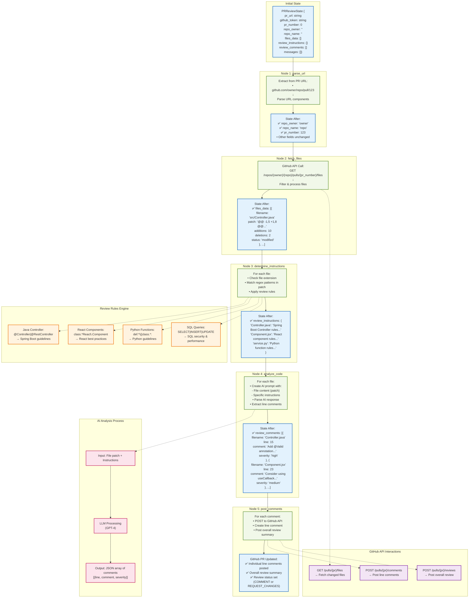

```mermaid 


flowchart TD
    subgraph "Initial State"
        S0["PRReviewState {<br/>pr_url: string<br/>github_token: string<br/>pr_number: 0<br/>repo_owner: ''<br/>repo_name: ''<br/>files_data: []<br/>review_instructions: {}<br/>review_comments: []<br/>messages: []}"]
    end

    subgraph "Node 1: parse_url"
        N1["Extract from PR URL:<br/>• github.com/owner/repo/pull/123<br/>↓<br/>Parse URL components"]
        S1["State After:<br/>✅ repo_owner: 'owner'<br/>✅ repo_name: 'repo'<br/>✅ pr_number: 123<br/>• Other fields unchanged"]
    end

    subgraph "Node 2: fetch_files"
        N2["GitHub API Call:<br/>GET /repos/{owner}/{repo}/pulls/{pr_number}/files<br/>↓<br/>Filter & process files"]
        S2["State After:<br/>✅ files_data: [{<br/>  filename: 'src/Controller.java'<br/>  patch: '@@ -1,5 +1,8 @@...'<br/>  additions: 10<br/>  deletions: 2<br/>  status: 'modified'<br/>}, ...]"]
    end

    subgraph "Node 3: determine_instructions"
        N3["For each file:<br/>• Check file extension<br/>• Match regex patterns in patch<br/>• Apply review rules"]
        S3["State After:<br/>✅ review_instructions: {<br/>  'Controller.java': 'Spring Boot Controller rules...'<br/>  'Component.jsx': 'React component rules...'<br/>  'service.py': 'Python function rules...'<br/>}"]
    end

    subgraph "Node 4: analyze_code"
        N4["For each file:<br/>• Create AI prompt with:<br/>  - File content (patch)<br/>  - Specific instructions<br/>• Parse AI response<br/>• Extract line comments"]
        S4["State After:<br/>✅ review_comments: [{<br/>  filename: 'Controller.java'<br/>  line: 15<br/>  comment: 'Add @Valid annotation...'<br/>  severity: 'high'<br/>}, {<br/>  filename: 'Component.jsx'<br/>  line: 23<br/>  comment: 'Consider using useCallback...'<br/>  severity: 'medium'<br/>}, ...]"]
    end

    subgraph "Node 5: post_comments"
        N5["For each comment:<br/>• POST to GitHub API<br/>• Create line comment<br/>• Post overall review summary"]
        S5["GitHub PR Updated:<br/>✅ Individual line comments posted<br/>✅ Overall review summary<br/>✅ Review status set<br/>(COMMENT or REQUEST_CHANGES)"]
    end

    subgraph "Review Rules Engine"
        R1["Java Controller:<br/>@Controller|@RestController<br/>→ Spring Boot guidelines"]
        R2["React Components:<br/>class.*React\.Component<br/>→ React best practices"]
        R3["Python Functions:<br/>def.*\(|class.*:<br/>→ Python guidelines"]
        R4["SQL Queries:<br/>SELECT|INSERT|UPDATE<br/>→ SQL security & performance"]
    end

    subgraph "AI Analysis Process"
        AI1["Input: File patch + Instructions"]
        AI2["LLM Processing<br/>(GPT-4)"]
        AI3["Output: JSON array of comments<br/>[{line, comment, severity}]"]
        AI1 --> AI2 --> AI3
    end

    subgraph "GitHub API Interactions"
        API1["GET /pulls/{pr}/files<br/>→ Fetch changed files"]
        API2["POST /pulls/{pr}/comments<br/>→ Post line comments"]
        API3["POST /pulls/{pr}/reviews<br/>→ Post overall review"]
    end

    %% Main flow
    S0 --> N1 --> S1
    S1 --> N2 --> S2
    S2 --> N3 --> S3
    S3 --> N4 --> S4
    S4 --> N5 --> S5

    %% Side connections
    N3 -.-> R1
    N3 -.-> R2
    N3 -.-> R3
    N3 -.-> R4

    N4 -.-> AI1
    
    N2 -.-> API1
    N5 -.-> API2
    N5 -.-> API3

    %% Styling
    classDef stateBox fill:#e3f2fd,stroke:#1565c0,stroke-width:2px
    classDef nodeBox fill:#f1f8e9,stroke:#558b2f,stroke-width:2px
    classDef rulesBox fill:#fff3e0,stroke:#ef6c00,stroke-width:2px
    classDef aiBox fill:#fce4ec,stroke:#c2185b,stroke-width:2px
    classDef apiBox fill:#f3e5f5,stroke:#7b1fa2,stroke-width:2px

    class S0,S1,S2,S3,S4,S5 stateBox
    class N1,N2,N3,N4,N5 nodeBox
    class R1,R2,R3,R4 rulesBox
    class AI1,AI2,AI3 aiBox
    class API1,API2,API3 apiBox


```
